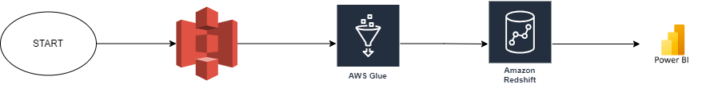

# AIRFLOW PROJECTS

## List of projects
1. [Load data from PostgresSQL to S3](#load-data-from-postgressql-to-s3)
2. [Load data from a local storage to S3 and to RedShift](#load-data-from-a-local-storage-to-s3-then-to-redshift)
3. [Transform data from S3 to RedShift by Glue job](#transform-data-from-s3-to-redshift-by-glue-job)


## Preparation

1. Installing dependencies in EC2
```bash
sudo apt update
sudo apt install awscli
sudo apt install python3-pip
sudo apt install python3.10-venv
python3 -m venv airflow_venv
sudo pip install pandas 
sudo pip install s3fs
sudo pip install fsspec
sudo pip install apache-airflow
sudo pip install apache-airflow-providers-postgres
sudo pip install apache-airflow-providers-amazon
```

2. Configuring EC2 instant

    * Add port 8080 of custom TCP for connecting aiflow server through public IP

    

3. Adding connections in Airflow

    * AWS connection
    

    * PostgresSQL connection
    

    * RedShift connection
    


## Load data from PostgresSQL to S3
<details>
  <summary>Load more</summary>

* The used data in this project is collected from [weather](https://openweathermap.org)
* The services used in the project, are AWS RDS (PostgresSQL), AWS EC2 (Airflow), AWS S3.
* The data from API and data from [S3 file](weather-pipeline/us-city.csv) that are moved to PostgresSql and then combining tables is converted to CSV file and saved to S3.


* The Airflow graph. [code file](weather-pipeline/weather_dag.py)


</details>

## Load data from a local storage to S3 then to RedShift
<details>
  <summary>Load more</summary>

* The used data in this project is collected from [RapidAPI](https://rapidapi.com/)
* The services used in the project, are AWS EC2 (Airflow), AWS S3, AWS Lambda, AWS RedShift, AWS QuickSight.
* The data from API is saved into S3. The data is transformed and loaded to other S3 buckets by [Lambda triggers](zillow-pipeline/lambda/). Airflow is watching the file in S3 and loading it to RedShift. The data in RedShift is exported to QuickSight.


* The Airflow graph. [code file](zillow-pipeline/zillow_dag.py)


* The Data in RedShift. 


* The Graphs in QuickSight. 


</details>

## Transform data from S3 to RedShift by Glue job
<details>
  <summary>Load more</summary>

* The used data in this project is collected from [kaggle](https://kaggle.com/datasets/yeanzc/telco-customer-churn-ibm-dataset/)

* The services used in the project, are AWS EC2 (Airflow), AWS S3, AWS Glue, AWS RedShift, Power BI.

* The data is saved into S3. The data is transformed and loaded to RedShift by Glue ETL. Airflow is watching the Glue Job. The data in RedShift is exported to Power BI.

* The data can be collected by Glue Crawler. Users can analyse the data through AwS Athena.



* The Glue ETL. [configurate file](customer-churn-pipeline/S3-to-redshift.py)


* The Airflow graph. [code file](customer-churn-pipeline/customer-churn-dag.py)


* Glue Crawlers.


* The Data in Athena. 


* The Graphs in PowerBI. 


  
</details>